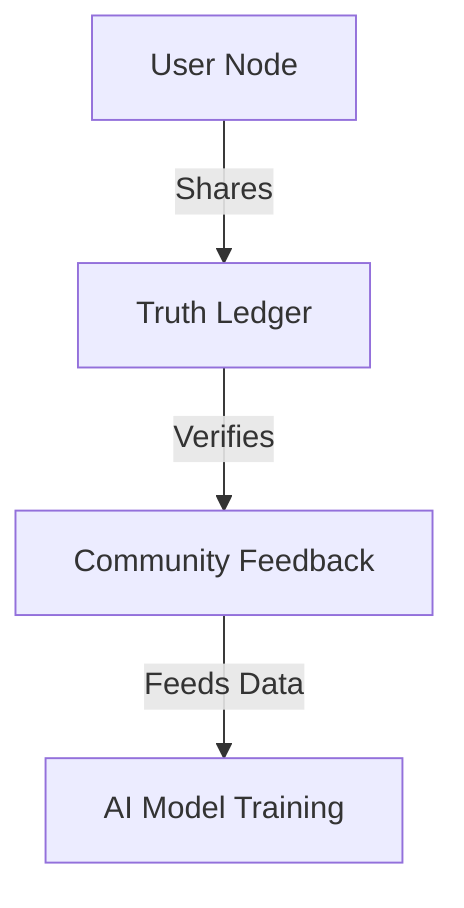

# VeritasNewsAI 🌍⚡  
**The Future of Automated News Production**

Welcome to **VeritasNewsAI** – an advanced AI-driven news production platform that automates research, script generation, audio synthesis, and video production. Our goal is to **redefine modern news automation** with cutting-edge AI, ensuring fast, reliable, and unbiased content.

---

## 🚀 Current State (v0.8 Beta)  

### ✅ Core Capabilities  

```python
# News Production Pipeline
pipeline = [
    NewsResearch(),       # Aggregates 50+ verified sources
    ScriptGeneration(),   # Produces TTS-optimized scripts
    AudioProduction()     # Generates synthesized voiceovers
]
```

- **Automated News Research** → 50+ trusted sources analyzed in real-time.  
- **AI-Powered Script Generation** → Broadcast-ready, optimized for voice synthesis.  
- **TTS & Audio Production** → Converts scripts into professional-grade voiceovers.  
- **Basic Video Assembly** → Uses templates for preliminary video content.  

---

## 🔥 Upcoming Features (Q4 2024+)  

### 🚧 Next-Gen Automation Pipeline  

```python
# Upcoming Pipeline Extensions
pipeline += [
    VideoSceneGenerator(),  # Uses MiniMax API for scene generation
    AutoVideoEditor(),      # PyAutoGUI + Movavi for automated editing
    YouTubeUploader()       # Seamless multi-platform publishing
]
```

- **🎬 Video Automation** → AI-powered scene-by-scene video generation.  
- **📡 Multi-Platform Publishing** → Automates YouTube & social media distribution.  
- **📊 Performance Analytics** → Monitors reach & engagement across platforms.  

---

## 🗺️ Roadmap  

### **Phase 1: Core Automation (Now - Dec 2024)**  


### **Phase 2: Full Automation (2025)**  


### **Phase 3: Decentralized Network (2026+)**  


---

## 🤝 Join the Build  

We welcome **contributors** from various fields:  

- **Python Developers** → Automation, AI, data processing  
- **AI/ML Engineers** → NLP, TTS, video synthesis  
- **Video Engineers** → Movavi automation, PyAutoGUI scripting  
- **Community Moderators** → Help manage and shape discussions  

### 🎯 Example: Auto-Video Editor (Help Wanted!)

```python
def auto_edit_video(script: Script) -> Video:
    # Generate scenes using MiniMax API
    scenes = MiniMaxAPI.generate_scenes(script)
    
    # Automate video editing with Movavi + PyAutoGUI
    with MovaviController() as editor:
        editor.create_project("daily_news")
        for scene in scenes:
            editor.add_clip(scene.video_path)
            editor.add_text_overlay(scene.headline, position=(0.1, 0.8))  # Lower third overlay
        editor.add_transition("news_wipe")
        editor.render(output="final_news.mp4")
    
    # Publish to YouTube
    return YouTubeUploader(
        title=script.headline,
        file="final_news.mp4",
        schedule="immediate"
    ).publish()
```

---

## 🛠️ How to Contribute  

### 1️⃣ Setup Your Development Environment  

```bash
# Clone the repository
git clone https://github.com/RorriMaesu/VeritasNewsAI
cd VeritasNewsAI

# Create a virtual environment
python -m venv .venv
.venv\Scripts\activate

# Install dependencies
pip install -r requirements-dev.txt
```

### 2️⃣ Pick an Issue & Start Building  
- [📌 Good First Issues](https://github.com/RorriMaesu/VeritasNewsAI/issues?q=is%3Aopen+is%3Aissue+label%3A%22good+first+issue%22)  
- [🎥 Video Automation Track](https://github.com/RorriMaesu/VeritasNewsAI/projects/1)  

---

## 💡 Our Vision  

At **VeritasNewsAI**, we are **reshaping the news industry** with AI-driven automation. This is a **forever-evolving project**, constantly adapting to new technologies and challenges.

*"Perfect is the enemy of truth." – Veritas Principle #3*  

**Join us and be part of the future of AI-powered journalism!** 🚀🎙️📡

🚀🔥