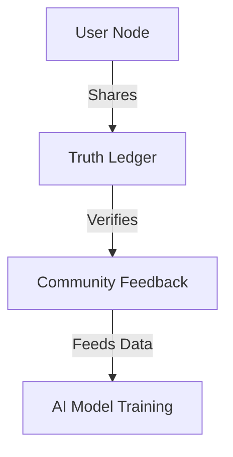

# VeritasNewsAI 🌍⚡  
**AI-Powered Automated News Production**

VeritasNewsAI is an **AI-driven, fully automated news production system** designed to research, generate, and publish news stories across multiple platforms. Our goal is to revolutionize journalism through **trusted AI automation** while maintaining accuracy and neutrality.

---

## 🚀 Current State (v0.8 Beta)  

### ✅ Core Capabilities  

```python
# News Production Pipeline
pipeline = [
    NewsResearch(),       # Aggregates 50+ verified sources
    ScriptGeneration(),   # Produces TTS-optimized scripts
    AudioProduction()     # Generates synthesized voiceovers
]
```

- **🔍 AI-Powered News Research** → Aggregates and analyzes news from 50+ trusted sources.
- **📝 Automated Script Generation** → Produces clean, concise, and voice-ready scripts.
- **🎙️ Text-to-Speech (TTS) Integration** → Generates professional-grade voiceovers.
- **📽️ Basic Video Production** → Uses templates for initial video creation.

---

## 🔥 Upcoming Features (Q4 2024+)  

### 🚧 Next-Gen AI Automation  

```python
# Upcoming Pipeline Extensions
pipeline += [
    VideoSceneGenerator(),  # Uses MiniMax API for AI scene generation
    AutoVideoEditor(),      # PyAutoGUI + Movavi for automated editing
    YouTubeUploader()       # Seamless multi-platform publishing
]
```

- **🎬 AI-Generated Videos** → Scene-by-scene generation with MiniMax API.
- **📡 Multi-Platform Publishing** → Auto-uploads to YouTube, TikTok & news sites.
- **📊 Performance Analytics** → AI-driven monitoring & audience insights.

---

## 🗺️ Roadmap  

### **Phase 1: Core Automation (Now - Dec 2024)**  


### **Phase 2: Full Automation (2025)**  


### **Phase 3: Decentralized News Network (2026+)**  


---

## 🧠 AI Models & Infrastructure  

We leverage **DeepSeek R1** as our primary **local AI model** running on OLLAMA.  
This ensures **privacy, security, and full control** over the LLM-based news generation.  

```ini
# LLM Provider
LLM_PROVIDER=ollama
OLLAMA_MODEL=llama2
```

Other APIs & services include:
- **DeepSeek R1** (local LLM) → Runs offline for secure AI processing.
- **MiniMax API** → For automated video scene generation.
- **ElevenLabs** → High-quality AI-generated voice synthesis.
- **Google AI** → Generative AI capabilities for additional processing.
- **Reddit & Twitter APIs** → News trend tracking.

---

## 📦 Dependencies  

To ensure full functionality, install the following dependencies:

```ini
# API Keys
DEEPSEEK_API_KEY=your_deepseek_key_here
MINIMAX_API_KEY=your_minimax_key_here
ELEVENLABS_KEY=your_elevenlabs_key_here
GOOGLE_API_KEY=your_google_key_here
GOOGLE_CLOUD_PROJECT=your_googlecloudproject_key_here
REDDIT_CLIENT_ID=your_redditclient_id_here
REDDIT_CLIENT_SECRET=your_redditsecret_key_here
```

Required Python libraries:

```ini
feedparser
gnews
PyYAML
pytz
praw
tweepy
python-dotenv
google-cloud-aiplatform==1.35.0
requests-cache==1.1.0
textstat==0.7.3
requests==2.31.0
google.generativeai==0.3.1
gTTS
tenacity
```

---

## 🤝 Join the Build  

We welcome **contributors** from various fields:  

- **Python Developers** → Automation, AI, data processing  
- **AI/ML Engineers** → NLP, TTS, video synthesis  
- **Video Engineers** → Movavi automation, PyAutoGUI scripting  
- **Community Moderators** → Help manage and shape discussions  

### 🎯 Example: Auto-Video Editor (Help Wanted!)

```python
def auto_edit_video(script: Script) -> Video:
    # Generate scenes using MiniMax API
    scenes = MiniMaxAPI.generate_scenes(script)
    
    # Automate video editing with Movavi + PyAutoGUI
    with MovaviController() as editor:
        editor.create_project("daily_news")
        for scene in scenes:
            editor.add_clip(scene.video_path)
            editor.add_text_overlay(scene.headline, position=(0.1, 0.8))  # Lower third overlay
        editor.add_transition("news_wipe")
        editor.render(output="final_news.mp4")
    
    # Publish to YouTube
    return YouTubeUploader(
        title=script.headline,
        file="final_news.mp4",
        schedule="immediate"
    ).publish()
```

---

## 🛠️ How to Contribute  

### 1️⃣ Setup Your Development Environment  

```bash
# Clone the repository
git clone https://github.com/RorriMaesu/VeritasNewsAI
cd VeritasNewsAI

# Create a virtual environment
python -m venv .venv
.venv\Scripts\activate

# Install dependencies
pip install -r requirements-dev.txt
```

### 2️⃣ Pick an Issue & Start Building  
- [📌 Good First Issues](https://github.com/RorriMaesu/VeritasNewsAI/issues?q=is%3Aopen+is%3Aissue+label%3A%22good+first+issue%22)  
- [🎥 Video Automation Track](https://github.com/RorriMaesu/VeritasNewsAI/projects/1)  

---

## 💡 Our Vision  

At **VeritasNewsAI**, we are **reshaping the news industry** with AI-driven automation. This is a **forever-evolving project**, constantly adapting to new technologies and challenges.

*"Perfect is the enemy of truth." – Veritas Principle #3*  

🚀 **Join us and be part of the future of AI-powered journalism!** 🎙️📡
🚀🔥
